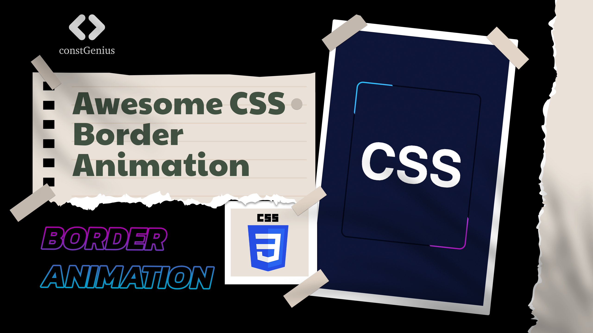

# Awesome CSS Border Animation | Border Animation CSS | Quick Animation

The "Awesome CSS Border Animation" is a captivating and visually dynamic web design technique that utilizes Cascading Style Sheets (CSS) to create stunning border animations on web elements. This technique enhances the user experience by adding an engaging visual element to various elements on a webpage, such as buttons, images, or divs. Through the clever use of CSS transitions, keyframes, and border properties, this animation brings life and interactivity to web interfaces, making them more engaging and visually appealing. Whether it's subtle pulsating borders or intricate patterns, this CSS border animation adds a touch of creativity and sophistication to web design.

Live Preview: https://constgenius.github.io/BorderAnimation/

